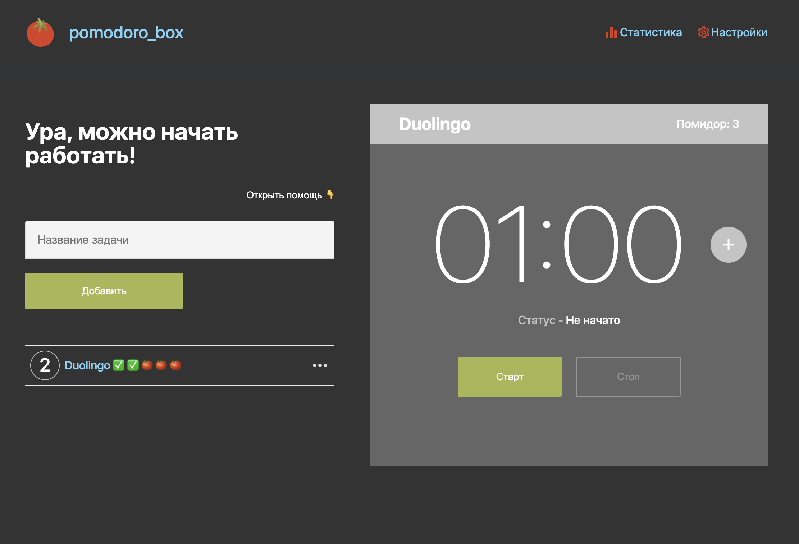
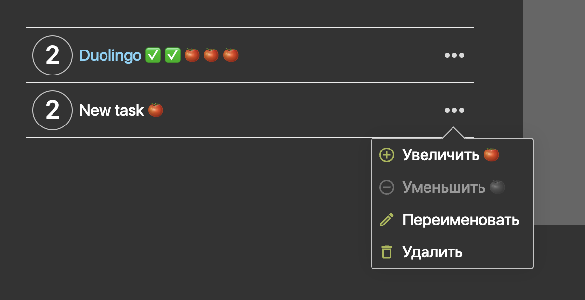
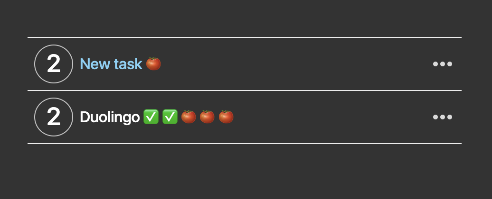
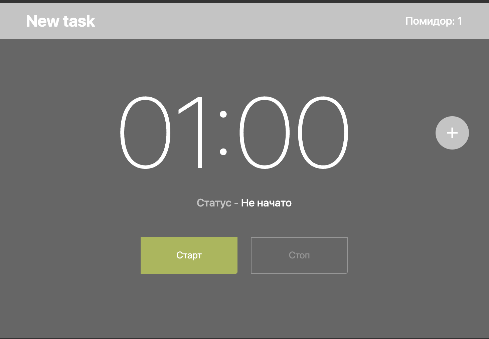
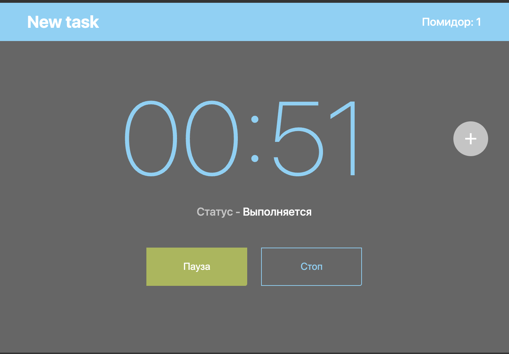
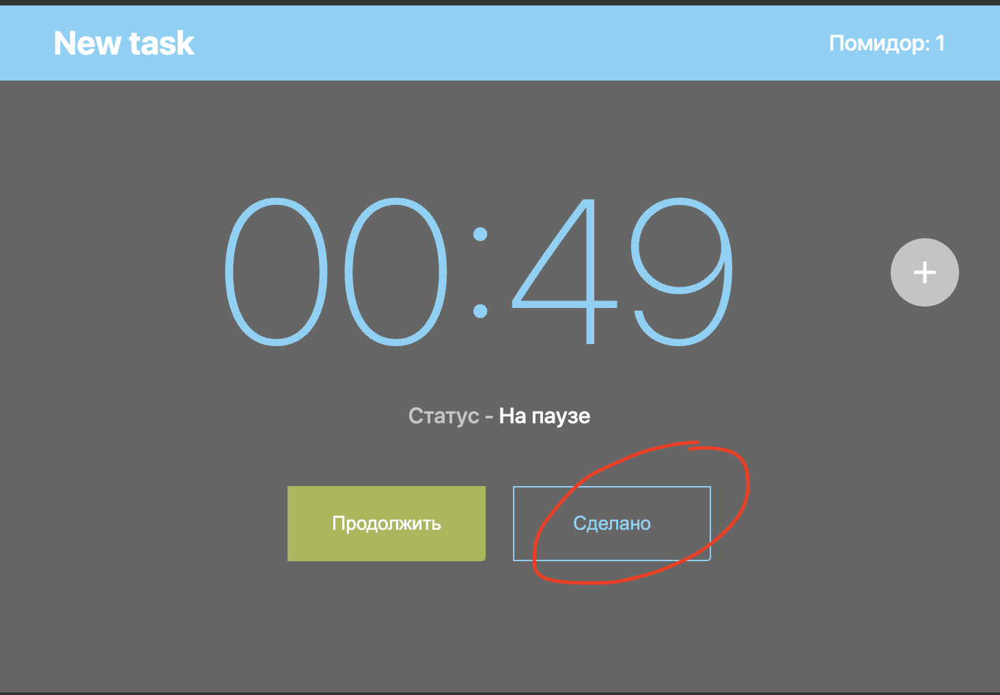
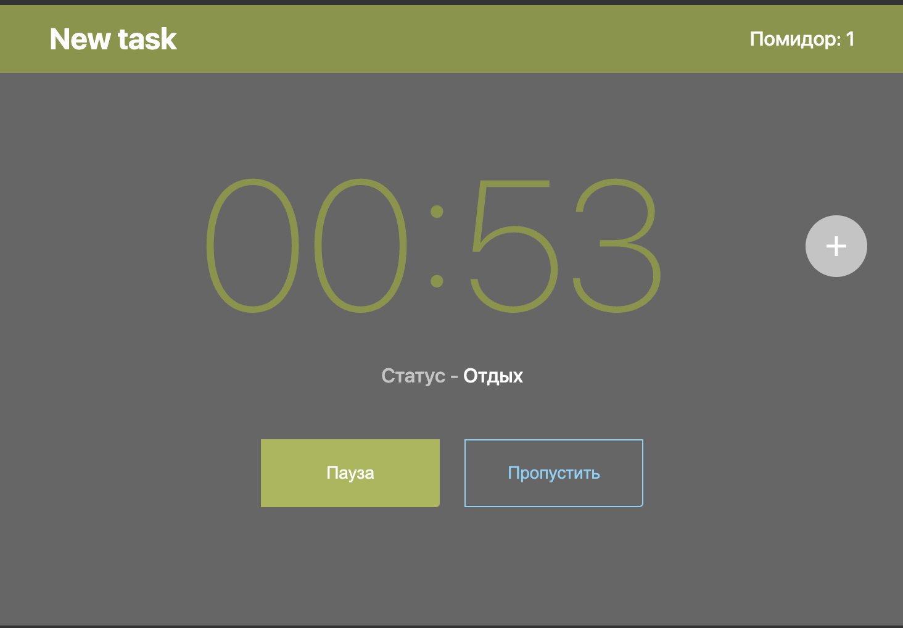
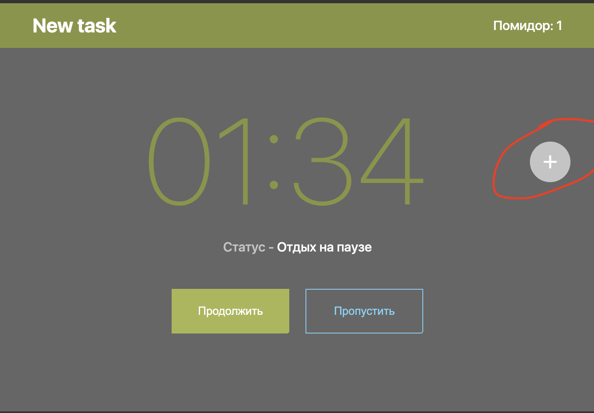
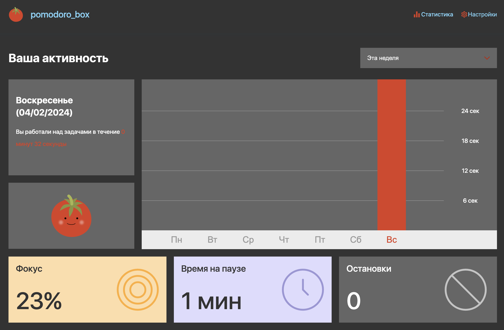

# Pomodoro Box

[](https://github.com/grauds/clematis.poc.pomodoro/actions/workflows/docker-image.yml)



**This project is in beta, internationalization support is under development**

The Pomodoro Box application implements the Pomodoro time management technique developed by Francesco Cirillo in the late 1980s. It uses the kitchen timer metaphor to track the time needed to make a step in the task you're currently doing, expecially if a deadline is close. 

## 🍅 Features

* Configure time spent in one step, the span of the following break and also sound notification after each completed step, aka 'pomodoro'
* Configure the number of pomodoro needed for each task, the more complex the task is, the more pomodori is needed
* Collect and save three week statistics for the time spent on tasks, focus ratio and the number of interruptions, the number of accomplished pomodori
* Choose between light, dark and system themes

## 🍅 Quick start

Checkout the code and run the docker build, assuming that your computer has Docker environment installed:
```
git 'https://github.com/grauds/clematis.poc.pomodoro.git'
```
```
docker build . -t clematis.poc.pomodoro -f Dockerfile
```
Run the image with Docker compose:
```
docker compose build
```
```
docker compose up -d
```
The application will be available at: http://localhost:18084

## 🍅 Development

This is a React application with Server Side Rendering and Typescript under the hood. Checkout the code and install node dependencies first:

```
npm install
```

Then run the project locally

```
npm run dev
```

The application will be available at: http://localhost:3000 and will automatically reload if you change any of the source files.

## 🍅 Jenkins Deployment

Please consult Jenkins documentation on how to configure a Pipeline from Jenkinsfile from the root of the repository. Once configured, it can build and deploy a docker container with the app on the same server this Jenkins is installed on.

## 🍅 How To

### Make a task

New task is always added to the end of the tasks list, the number of the new task is the length of the list. User can add more pomodori to it or remove extra pomodori added, this is the process of task estimation. The system ensures that at least one pomodoro is left for the task. Each task can also be renamed or removed.



### Start a task 

A task must be dragged to the top of the list with the mouse or gesture on a touchscreen before it can be started:



The next step is to click 'Start' button on the counter



### Pause a running task

Counter shows the current task name in the header and the number of pomodoro currently running. To pause the countdown click on 'Pause' button. The time on pause is being logged in statistics.

**Note:** clicking on 'Stop' button will stop the timer and reset the pomodoro to initial amount of time. Time spent before stopping will not be lost and will be recorded in statistics.




### Resume or complete a paused task

Once a task is on pause, user has two ways to continue:

1. Continue running the pomodoro by clicking 'Continue'
2. Mark pomodoro as done by clicking 'Done' (circled in red). If this is the last pomodoro in task, the whole task will change its status to 'Done'



### Skip a break

After a pomodoro is complete, the counter automatically switches either to a short or to a long break and the sound alarm is ringing. Break is essential for recuperation and estimation of previous pomodoro results.

As before, user has some options to deal with a break:

1. Wait before the break is due. The new pomodoro will be displayed, and the current one is replaced with a green tick in the tasks list. The next pomodoro won't be started automatically.
2. Put the break on pause, it would mean that the user is distracted, and the time on pause is counted in statistics.
3. Skip the break to proceed with the next pomodoro. The next pomodoro won't be started automatically.



### Add a minute to a running task or to break

User can add a minute once in a while to a running pomodoro or a break with the plus button.




### See the statistics

Statistics is available by clicking the link in the header. Another page will be opened. Week selector allows to jump to one of three weeks available, clicking on day abbraviation in the chart selects a day of the week, allowing to see stats for the selected day, including:

* statistics for the time spent on tasks 
* focus ratio = time spent on tasks / time spent on tasks + time on pauses
* time spent on pause 
* the number of accomplished pomodori




