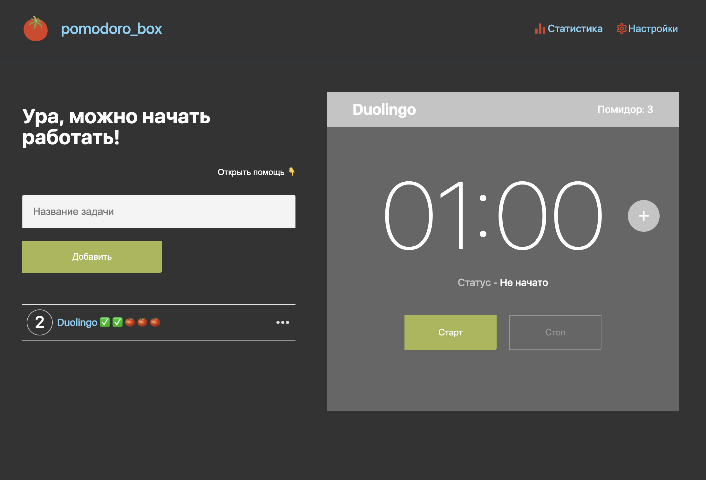

# Pomodoro Box



The Pomodoro Box application implements the Pomodoro time management technique developed by Francesco Cirillo in the late 1980s. It uses the kitchen timer metaphor to track the time needed to make a step in the task you're currently doing, expecially if a deadline is close. 

## 🍅 Features

* Configure time spent in one step, the span of the following break and also sound notification after each completed step, aka 'pomodoro'
* Configure the number of pomodoro needed for each task, the more complex the task is, the more pomodori is needed
* Collect and save three week statistics for the time spent on tasks, focus ratio and the number of interruptions, the number of accomplished pomodori
* Choose between light, dark and system themes

## 🍅 Quick start

Checkout the code and run the docker build, assuming that your computer has Docker environment installed:
```
git 'https://github.com/grauds/clematis.poc.pomodoro.git'
```
```
docker build . -t clematis.poc.pomodoro -f Dockerfile
```
Run the image with Docker compose:
```
docker compose build
```
```
docker compose up -d
```
The application will be available at: http://localhost:18084

## 🍅 Development

This is a React application with Server Side Rendering and Typescript under the hood. Checkout the code and install node dependencies first:

```
npm install
```

Then run the project locally

```
npm run dev
```

The application will be available at: http://localhost:3000

## 🍅 Jenkins Deployment

Please consult Jenkins documentation on how to configure a Pipeline from Jenkinsfile from the root of the repository. Once configured, it can build and deploy a docker container with the app on the same server this Jenkins is installed on.
